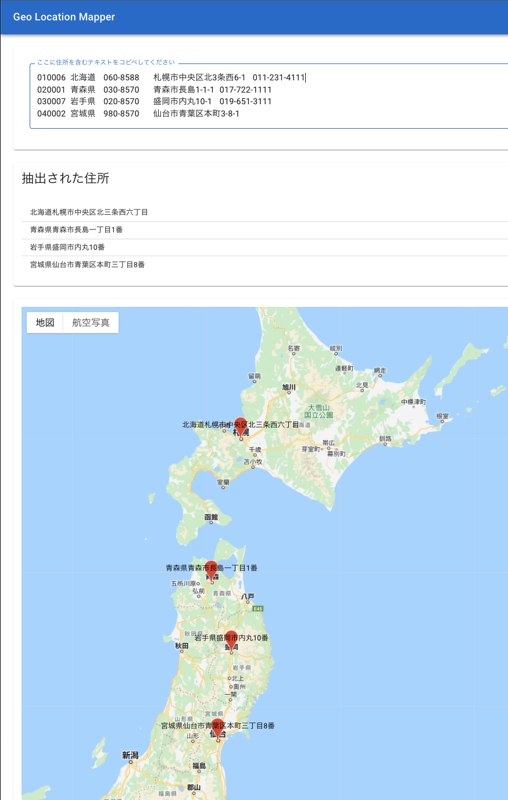
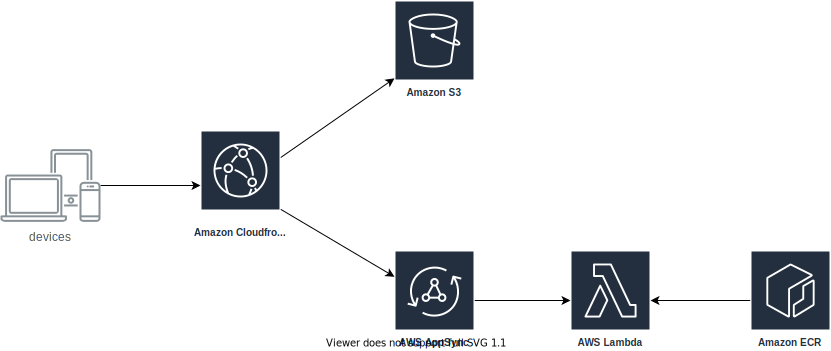

# Geo Location Mapper

Extract addresses from any text and map them (Japanese only).


## Tech stack

- Frontend
  - React
  - SWR
  - graphql-react
  - [GraphQL Code Generator](https://www.graphql-code-generator.com/)
- Backend

  - [PyGeoNLP](https://geonlp.ex.nii.ac.jp/doc/pygeonlp/)

  

## How to deploy

- Create Google map api key  
  https://developers.google.com/maps/documentation/javascript/get-api-key

- Deploy backend stack using aws cdk
  `cdk deploy BackendStack`

- Check AppSync ID and api key

  - ID  
    `aws appsync list-graphql-apis | jq '.graphqlApis[] | select(.name == "GeoMapperApi") | .apiId'`
  - api key  
    `aws appsync list-api-keys --api-id ISSUED_API_ID | jq '.apiKeys[].id'`

- Create .env file on `frontend` directory

```.env
REACT_APP_GOOGLE_MAP_API_KEY=YOUR_GOOGLE_MAP_API_KEY
AWS_REGION=YOUR_AWS_REGION
APPSYNC_API_ID=ISSUED_API_ID
APPSYNC_API_KEY=ISSUED_API_KEY
```

- Build frontend
  `cd frontend`  
  `npm run build`

- Deploy frontend stack  
  `cdk deploy FrontendStack`
